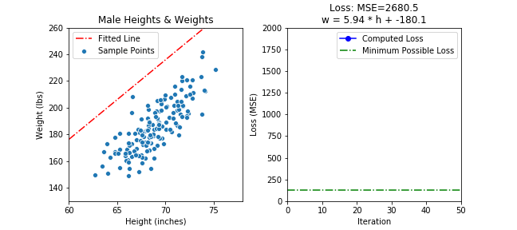

 

## Toptal Blog Post by Alan Reiner
#### Use Tensorflow for More than Deep Learning
##### Author: Alan Reiner
##### March 2020

-----

This repo contains the complete, fully-functional code for all the examples contained in my blog post:

* [Use Tensorflow for More than Deep Learning (TBA)](...)

The code snippets in the blog post are abridged, leaving out some of the messy implementation details such as learning optimizations and the code that produces the pretty visuals.  The notebooks in this repo were the original source of the text and visuals in the post, but functional, optimized and documented.

-----

Notebook Links:

1. [Intro:  Simple Linear Regression with Gradient Descent & Tensorflow 2.0](simple_height_vs_weight/tf_grad_desc_intro.ipynb)
2. [Maximal Vector Spread Problem with Gradient Descent](vector_spread_example/vector_spread_example.ipynb)
3. [Adversarial Attack on an Image Classifier Neural Net](adversarial_example/adversarial_cats_dogs.ipynb)
4. Final Thoughts:  Using Optimizers -- Relevant code at the end of the [Intro Notebook](simple_height_vs_weight/tf_grad_desc_intro.ipynb)

I have included summaries

## Section Summaries

#####  1. [Intro:  Simple Linear Regression with Gradient Descent & Tensorflow 2.0](simple_height_vs_weight/tf_grad_desc_intro.ipynb)
 

This section solves an over-simplified linear regression problem.  This section of the blog post is tailored towards the less-technical, walking through the purpose of gradient descent and deriving the simple math for Linear Regression.  It also has the simplest Tensorflow code snippets.

The final result is animations the show gradient descent converging from an imperfect initial guess: 

 -----
 
 
##### 2. [Maximal Vector Spread Problem with Gradient Descent](vector_spread_example/vector_spread_example.ipynb)
 
 This section describes an interesting problem I ran into last year, which appears to have only numerical solutions.  We attempt it a couple different ways with gradient descent, demonstrated with Tensorflow 2.0.
 
 The goal is to find a set of maximally spread unit-vectors on an N-dimensional sphere.
 
 
 
 
  -----
 
 
##### 3. [Adversarial Attacks on a Image Classification Neural Net](adversarial_example/adversarial_cats_dogs.ipynb)

This final section exposes an inherent weakness is standard image classifiers that operate on large images.  Using gradient descent, we can find imperceptible changes in each pixel (in each color channel) that cumulatively alter the output of the network. 

The network was taken from a random cat-vs-dog classification task on Kaggle, and then attacked using Tensorflow 2.0 to implement a modified gradient descent algorithm.

This is not a deficiency in this particular neural net, but identifying a fundamental vulnerability in neural networks that have a high number of inputs, if mitigation measures are not implemented.

#####  4. [Final Thoughts: Using Optimizers](simple_height_vs_weight/tf_grad_desc_intro.ipynb)
(NOTE: This sample code is at the end of the Into Notebook)

This section explains that we have been manually applying gradients in our example code, even though it is better to use "optimizers" the vast majority of the time (the adversarial example is an exception).  We explain why optimizers tend to be better with minimal code modification, and show the results of two optimizers, one which converges quickly, and the other which has some "quirks" on this simple problem.

#### RMSprop Optimizer (Great)

#### Adam Optimizer (Not so great)

