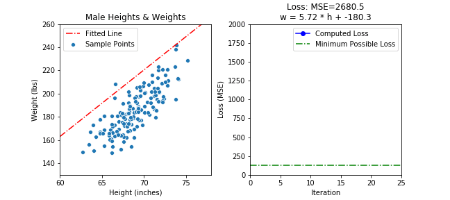

 

## Toptal Blog Post by Alan Reiner
#### Use Tensorflow for More than Deep Learning
##### Author: Alan Reiner
##### (NOT YET PUBLISHED - Expected April 2020)

-----

This repo contains the complete, fully-functional code for all the examples contained in my soon-to-be-published blog post:

* [Use Tensorflow for More than Deep Learning (TBA)](...)

The code snippets in the blog post are abridged, leaving out some of the messy implementation details such as learning optimizations and the code that produces the pretty visuals.  These are the source notebooks with full documentation, and should work out of the box if basic DS/ML packages are installed.

-----

Notebook Links:

1. [Intro:  Simple Linear Regression with Gradient Descent & Tensorflow 2.0](simple_height_vs_weight/tf_grad_desc_intro.ipynb)
2. [Maximal Vector Spread Problem](vector_spread_example/vector_spread_example.ipynb)
3. [Adversarial Attack on an Dog-vs-Cat Image Classifier](adversarial_example/adversarial_cats_dogs.ipynb)
4. Final Thoughts:  Using Optimizers -- Relevant code at the end of the [Intro Notebook](simple_height_vs_weight/tf_grad_desc_intro.ipynb)

-----

### Section Summaries

####  1. [Intro:  Simple Linear Regression with Gradient Descent & Tensorflow 2.0](simple_height_vs_weight/tf_grad_desc_intro.ipynb)
 

This section of the blog post is tailored towards less-technical readers, explaining the purpose of gradient descent and showing how it can be used for a simple linear regression problem.  However, even for those who already understand both topics, it's worth looking at the code snippets at the end, to see how simple it can be to implement in Tensorflow 2.0.

The final result is animations the show gradient descent converging from an imperfect initial guess: 

 -----
 
 
#### 2. [Maximal Vector Spread Problem with Gradient Descent](vector_spread_example/vector_spread_example.ipynb)
 
This section describes an interesting problem I ran into last year, which appears to have only numerical solutions.   The goal is to find a set of maximally spread unit-vectors on an N-dimensional sphere.  We attempt it three different ways with gradient descent and Tensorflow 2.0.

Here's what the most advanced solution looks like.  The code for this solution is actually quite complex, but Tensorflow 2.0 successfully tracks gradients through hundreds of tensor operations to produce a solid result.
 
 
 
 
  -----
 
 
#### 3. [Adversarial Attacks on an Image Classification Neural Net](adversarial_example/adversarial_cats_dogs.ipynb)

This final section exposes an inherent weakness in standard image classifiers that operate on large images.  Using gradient descent, we can find imperceptible changes in each color channel for each pixel (128x128x3=49,152 input values) that cumulatively alter the output of the network. 

The pre-trained network was downloaded from a Dog-vs-Cat image classification challenge on Kaggle.  We applied a modified gradient descent algorithm that completely fools the image classifier with only four iterations.

We are not trying to highlight a deficiency in this particular neural net, but identify a fundamental vulnerability in all neural networks that have a high number of inputs.  To date, there are techniques to dampen the effect of this kind of attack, but few are able to fully prevent it.

-----

####  4. [Final Thoughts: Using Optimizers](simple_height_vs_weight/tf_grad_desc_intro.ipynb)
(NOTE: This sample code is at the end of the first, Intro Notebook)

In all the examples so far we have been manually applying gradients to our trainable parameters. However, it is almost always better to use "optimizers" (the adversarial example is an exception).  We explain why optimizers tend to be better, and require very little extra code to implement. We  show the results of two optimizers, one which converges quickly, and the other which does not perform so well.  The lesson here is to always use optimizers, but make the choice of optimizer one of your parameters to hypertune.  Each kind of problem is well-suited to a different optimizer.

#### RMSprop Optimizer (Great)

#### Adam Optimizer (Not so great)

It is standard practice to start your training code with the Adam optimizer, but it's clear it is not always the best choice, so you will have to try different ones for each problem.

-----

