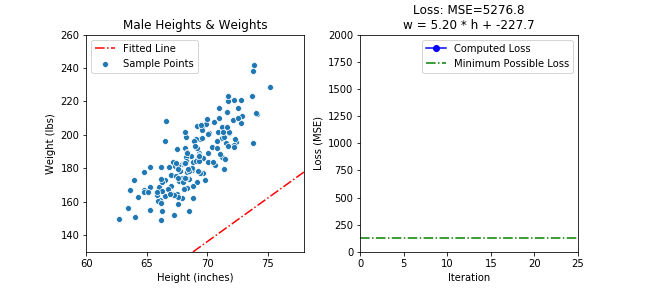

 

## Toptal Blog Post by Alan Reiner
#### Use Tensorflow for More than Deep Learning
##### Author: Alan Reiner
#####March 2020

-----

This repo contains the complete, fully-functional code for all the examples contained in my blog post:

* [Use Tensorflow for More than Deep Learning (TBA)](...)

The code snippets in the blog post are abridged, leaving out some of the messy implementation details such as learning optimizations and the code that produces the pretty visuals.  The notebooks in this repo were the original source of the text and visuals in the post, but functional, optimized and documented.

-----

Notebook Links:

1. [Intro:  Simple Linear Regression with Gradient Descent & Tensorflow 2.0](simple_height_vs_weight/tf_grad_desc_intro.ipynb)
2. [Maximal Vector Spread Problem with Gradient Descent](vector_spread_example/vector_spread_example.ipynb)
3. [Adversarial Attack on an Image Classifier Neural Net](adversarial_example/adversarial_cats_dogs.ipynb)
4. Final Thoughts:  Using Optimizers -- Relevant code at the end of the [Intro Notebook](simple_height_vs_weight/tf_grad_desc_intro.ipynb)

## Summary

#####  1. [Intro:  Simple Linear Regression with Gradient Descent & Tensorflow 2.0](simple_height_vs_weight/tf_grad_desc_intro.ipynb)
 

This section solves an over-simplified linear regression problem.  This section of the blog post is tailored towards the less-technical, walking through the purpose of gradient descent and deriving the simple math for Linear Regression.  It also has the simplest Tensorflow code snippets.

The final result is animations the show gradient descent converging from an imperfect initial guess: 

 [Intro:  Simple Linear Regression with Gradient Descent & Tensorflow 2.0](simple_height_vs_weight/tf_grad_desc_intro.ipynb)
 
 